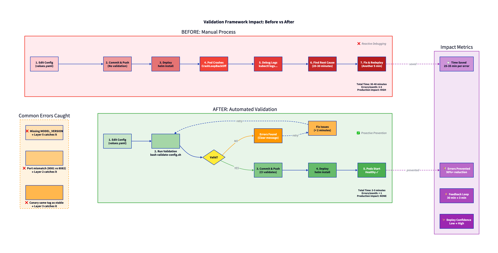
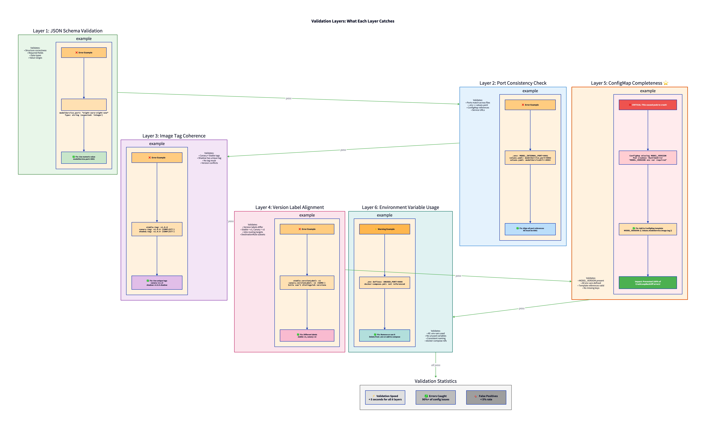

# SMS Spam Detection - Extension Proposal

## Configuration Validation Framework

This document proposes an extension to the SMS Spam Detection system: a **Configuration Validation Framework** that prevents deployment failures caused by configuration errors.

---

## Table of Contents

1. [Problem Statement](#problem-statement)
2. [Proposed Solution](#proposed-solution)
3. [Architecture](#architecture)
4. [Implementation Details](#implementation-details)
5. [Usage](#usage)
6. [CI/CD Integration](#cicd-integration)
7. [Expected Benefits](#expected-benefits)
8. [Rollout Strategy](#rollout-strategy)
9. [Diagrams](#diagrams)

---

## Problem Statement

### The Challenge

Configuration-related deployment failures are a significant source of downtime and debugging effort. In our SMS Spam Detection deployment, configuration is fragmented across multiple files:

- `.env` - Docker Compose environment variables
- `values.yaml` - Helm chart configuration
- Kubernetes manifests - Templates referencing configuration values

### Common Failure Scenarios

| Error Type | Root Cause | Impact |
|------------|------------|--------|
| **CrashLoopBackOff** | Missing `MODEL_VERSION` in ConfigMap | Pods fail to start |
| **Connection Refused** | Port mismatch between services | Service communication fails |
| **Image Pull Errors** | Canary using same tag as stable | Wrong version deployed |
| **Template Errors** | Invalid Helm template references | Deployment fails |

### Current State

- **3-5 configuration errors per month** causing deployment failures
- **20-30 minutes** average debugging time per error
- **No automated validation** before deployment

---

## Proposed Solution

A **6-layer validation framework** that catches configuration errors at development time rather than runtime.


*Diagram: Configuration Validation Framework architecture and components*

### Key Features

1. **Pre-deployment validation** - Catch errors before `helm install`
2. **Clear error messages** - Actionable feedback with fix instructions
3. **CI/CD integration** - Automated validation on pull requests
4. **Test suite** - Validate the validator itself

---

## Architecture

### Framework Components


*Diagram: The 6 validation layers and what each checks*

### File Structure

```
operation/k8s/validation/
├── validate-config.sh          # Main validation script
├── validate-schema.py          # JSON schema validator
├── pre-deployment-check.sh     # Pre-deployment orchestrator
├── install-dependencies.sh     # Dependency installer
└── tests/
    ├── run-tests.sh            # Test suite runner
    ├── test-values-valid.yaml
    ├── test-values-port-mismatch.yaml
    └── test-values-canary-conflict.yaml

operation/k8s/helm-chart/sms-spam-detector/
├── values.schema.json          # JSON Schema definition
└── values.yaml                 # Configuration file

operation/.github/workflows/
└── validate-config.yml         # CI/CD workflow
```

---

## Implementation Details

### Layer 1: JSON Schema Validation

Validates structural correctness of `values.yaml`:

- Required fields present
- Data types correct
- Port ranges valid (1024-65535)
- Version patterns match

**Schema excerpt**:
```json
{
  "properties": {
    "appService": {
      "properties": {
        "service": {
          "properties": {
            "port": {
              "type": "integer",
              "minimum": 1024,
              "maximum": 65535
            }
          }
        }
      }
    }
  }
}
```

### Layer 2: Port Consistency

Cross-validates ports across configuration files:

| Source | Key | Expected |
|--------|-----|----------|
| `.env` | `MODEL_INTERNAL_PORT` | 8081 |
| `values.yaml` | `modelService.service.port` | 8081 |
| `values.yaml` | `config.modelInternalPort` | 8081 |
| `values.yaml` | `config.modelServiceUrl` | `http://model-service:8081` |

All values must match for validation to pass.

### Layer 3: Image Tag Coherence

Ensures canary and shadow deployments use unique tags:

| Deployment | Tag | Status |
|------------|-----|--------|
| Stable | `v1.0.0` | Base version |
| Canary | `v1.0.0` | **ERROR**: Same as stable |
| Canary | `v1.1.0` | **PASS**: Different |
| Shadow | `v1.2.0-shadow` | **PASS**: Unique |

### Layer 4: Version Label Alignment

Validates version labels differ when canary is enabled:

```yaml
# Stable deployment
labels:
  version: v1

# Canary deployment
labels:
  version: v2  # Must differ from stable
```

### Layer 5: ConfigMap Completeness

**Critical fix implemented**: Ensures `MODEL_VERSION` is present in ConfigMap template.

**Before** (caused CrashLoopBackOff):
```yaml
# templates/configmap.yaml
data:
  MODEL_SERVICE_URL: {{ .Values.config.modelServiceUrl }}
  # MODEL_VERSION missing!
```

**After** (fixed):
```yaml
data:
  MODEL_SERVICE_URL: {{ .Values.config.modelServiceUrl }}
  MODEL_VERSION: {{ .Values.modelService.image.tag | replace "v" "" | quote }}
```

### Layer 6: Environment Variable Usage

Verifies all `.env` variables are referenced in `docker-compose.yml`.

### Before vs After Impact



*Diagram: Comparison of manual vs automated validation workflows and their impact on delivery speed.*

### Detailed Examples



*Diagram: Detailed examples of common configuration errors caught by each validation layer.*

---

## Usage

### Prerequisites

Install dependencies once:
```bash
bash k8s/validation/install-dependencies.sh
```

### Validation Workflow


*Diagram: Step-by-step validation and deployment workflow*

### Commands

```bash
cd operation

# Full validation (6 layers)
bash k8s/validation/validate-config.sh

# Pre-deployment check (validation + helm lint + kubectl dry-run)
bash k8s/validation/pre-deployment-check.sh

# Run test suite
bash k8s/validation/tests/run-tests.sh

# Then deploy
helm install sms-detector k8s/helm-chart/sms-spam-detector \
  -n sms-spam-detection --create-namespace
```

### Example Output

**Success**:
```
[Layer 1/6] JSON Schema Validation...
✅ PASS - Schema validation passed

[Layer 2/6] Port Consistency...
✅ PASS - All ports aligned

[Layer 3/6] Image Tag Coherence...
✅ PASS - Tags are unique

[Layer 4/6] Version Labels...
✅ PASS - Version labels correct

[Layer 5/6] ConfigMap Completeness...
✅ PASS - MODEL_VERSION present

[Layer 6/6] Environment Variables...
✅ PASS - All variables used

═══════════════════════════════════════
✅ VALIDATION PASSED - Safe to deploy
═══════════════════════════════════════
```

**Failure**:
```
[Layer 2/6] Port Consistency...
❌ ERROR - Port mismatch detected
   modelService.service.port: 8081
   config.modelInternalPort: 8082

Fix: Update values.yaml to align ports

═══════════════════════════════════════
❌ VALIDATION FAILED - 1 error(s)
═══════════════════════════════════════
```

---

## CI/CD Integration

### GitHub Actions Workflow

Automated validation on pull requests modifying configuration.

**Workflow File**: `.github/workflows/validate-config.yml`

**Triggers**:
- Pull requests modifying `k8s/helm-chart/**`, `.env`, or `docker-compose.yml`

**Actions**:
1. Install dependencies (yq, Python, Helm)
2. Run validation scripts
3. Post results as PR comment
4. Block merge if validation fails

### PR Comment Example

```markdown
## ✅ Configuration Validation Passed

| Check | Status |
|-------|--------|
| JSON Schema | ✅ Passed |
| Port Consistency | ✅ Passed |
| Image Tag Coherence | ✅ Passed |
| Version Labels | ✅ Passed |
| ConfigMap Completeness | ✅ Passed |
| Environment Variables | ✅ Passed |

Errors: 0
Warnings: 0
```

---

## Expected Benefits

### Metrics

| Metric | Before | After (Target) |
|--------|--------|----------------|
| Config-related failures | 3-5/month | < 1/month |
| Debug time per error | 20-30 min | < 5 min |
| PR validation time | 0 min (manual) | 3 min (automated) |
| False positive rate | N/A | < 5% |

### ROI

**Implementation effort**: 5 developer-days

**Expected reduction**: 90%+ of configuration-related deployment failures

### Benefits Summary

| Benefit | Description |
|---------|-------------|
| **Prevent Errors** | Catch port mismatches, missing vars, tag conflicts before deploy |
| **Faster Feedback** | < 5 min validation vs 20-30 min debugging |
| **Automated** | CI/CD integration removes manual verification |
| **Clear Messages** | Actionable error messages with fix instructions |

---

## Rollout Strategy

### Phased Approach

| Phase | Duration | Activities |
|-------|----------|------------|
| **Week 1: Soft Enforcement** | 5 days | Enable validation (don't block), monitor results, fix false positives |
| **Week 2: Fix Issues** | 5 days | Resolve common errors, achieve 90%+ pass rate, gather feedback |
| **Week 3: Hard Enforcement** | 5 days | Enable blocking on failure, announce switch date, monitor for 24 hours |

### Soft Enforcement (Escape Hatch)

For emergencies, validation can be bypassed:

```bash
# Environment variable override
VALIDATION_SOFT_ENFORCE=true bash k8s/validation/validate-config.sh

# Skip validation entirely (not recommended)
helm install sms-detector k8s/helm-chart/sms-spam-detector --no-hooks
```

### Success Criteria

- **Week 1**: < 10% false positive rate
- **Week 2**: 90%+ pass rate on valid configs
- **Week 3**: < 1 config-related failure after enabling hard enforcement

---

## Diagrams

All diagrams are provided in D2 format and can be rendered to SVG.

### Diagram Files

| Diagram | D2 Source | Description |
|---------|-----------|-------------|
| Validation Framework | [`diagrams/06-validation-framework.d2`](./diagrams/06-validation-framework.d2) | Framework architecture |
| Validation Layers | [`diagrams/07-validation-layers.d2`](./diagrams/07-validation-layers.d2) | 6-layer pipeline |
| Validation Workflow | [`diagrams/08-validation-workflow.d2`](./diagrams/08-validation-workflow.d2) | Deployment workflow |
| **Before vs After Impact** | [`diagrams/09-validation-impact.d2`](./diagrams/09-validation-impact.d2) | Comparison of manual vs automated validation |
| **Layer Details & Examples** | [`diagrams/10-validation-layer-details.d2`](./diagrams/10-validation-layer-details.d2) | Detailed examples of what each layer catches |

### Rendering Diagrams

```bash
# Install D2
brew install d2

# Render all extension diagrams
cd operation/docs/diagrams
d2 06-validation-framework.d2 06-validation-framework.svg
d2 07-validation-layers.d2 07-validation-layers.svg
d2 08-validation-workflow.d2 08-validation-workflow.svg
d2 09-validation-impact.d2 09-validation-impact.png
d2 10-validation-layer-details.d2 10-validation-layer-details.png
```

---

## Summary

The Configuration Validation Framework addresses a critical operational pain point by:

1. **Preventing failures** - 6-layer validation catches 90%+ of config errors
2. **Shifting left** - Errors caught at development time, not runtime
3. **Automating checks** - CI/CD integration removes manual verification
4. **Improving DX** - Clear error messages reduce debugging time

### Quick Reference

```bash
# Install once
bash k8s/validation/install-dependencies.sh

# Before every deployment
bash k8s/validation/validate-config.sh
bash k8s/validation/pre-deployment-check.sh

# Then deploy
helm install sms-detector k8s/helm-chart/sms-spam-detector -n sms-spam-detection
```

### Related Documentation

- **Deployment Documentation**: [deployment.md](./deployment.md)
- **Detailed Implementation**: [EXTENSION_PROPOSAL.md](./EXTENSION_PROPOSAL.md)
- **Helm Chart README**: `k8s/helm-chart/sms-spam-detector/README.md`
